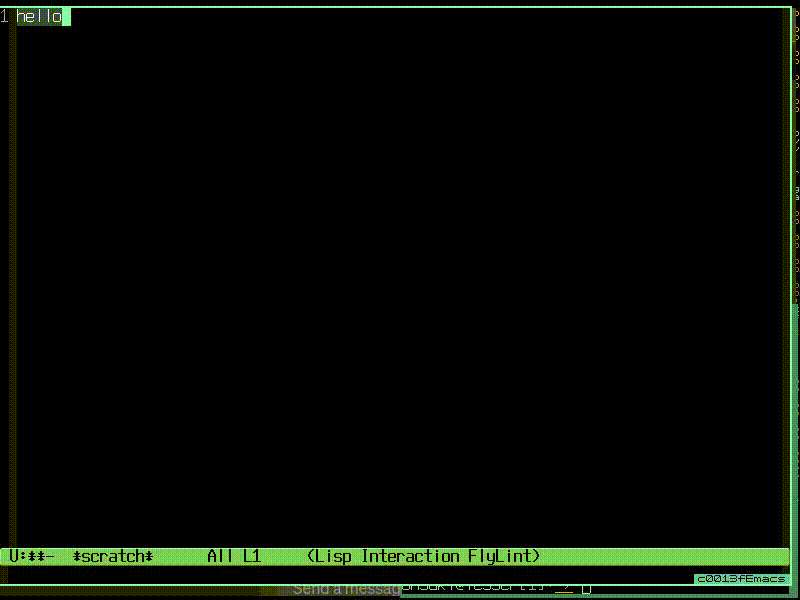
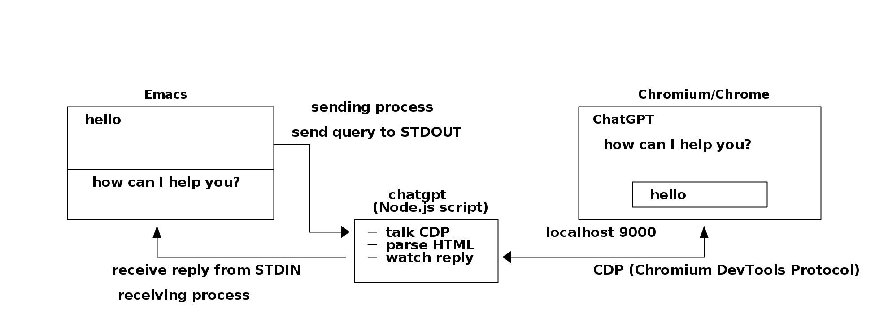

# NAME

chatgpt-el - access ChatGPT/Gemini/Calude from Emacs without APIs



# DESCRIPTION

**chatgpt-el** is an Emacs Lisp program designed to interactively access
ChatGPT/Gemini/Calude from within Emacs.  While those AIs can be accessed via
API interfaces using a programming language like Python and several modules,
such access has several drawbacks.

1. Batch processing through APIs is slow; accessing APIs is slow, and
   responses can often take an unnecessarily long time. Such slow response
   times can make accessing AIs frustrating.

2. Accessing AIs via APIs sometimes requires a non-free AI account with credit
   card registration. Frequent use of AIs can lead to high costs and require
   monitoring of AI billing records.

**chatgpt-el** solves the above issues by enabling access to
ChatGPT/Gemini/Calude within Emacs without the use of an API key.  The program
is implemented using Chromium/Chrome browser's CDP (Chrome DevTools Protocol)
(https://chromedevtools.github.io/devtools-protocol/), and therefore requires
a CDP-enabled Chromium/Chrome browser to be running.  **chatgpt-el** operates
by remotely controlling your instance of Chromium/Chrome using the Node.js
script called `chatgpt`, which is built on the Puppeteer library
(https://pptr.dev/). Therefore, your Chromium/Chrome browser must accept a CDP
connection from the `chatgpt` script.



Note that the implementation of the `chatgpt` script depends on the internal
structure of the HTML file returned by the ChatGPT/Gemini/Calude server. If
`chatgpt` does not work in your environment, you may need to modify the
program according to your environment.

# PREREQUISITES

- Chromium or Chrome browser (or other browsers supporting the CDP protocol).
- Node.js (https://nodejs.org/en).
- Puppeteer module (https://pptr.dev/)
- html-to-text moudle (https://github.com/html-to-text/node-html-to-text)

# INSTALLATION

``` sh
> sudo npm i -g puppeteer
> sudo npm i -g html-to-text
> git clone https://github.com/h-ohsaki/chatgpt-el.git
> cd chatgpt-el
> sudo install -m 644 chatgpt.el /usr/local/share/emacs/site-lisp
> cat <<EOF >>~/.emacs
;; chatgpt-el
(autoload 'chatgpt-query "chatgpt" nil t)
(autoload 'chatgpt-insert-reply "chatgpt" nil t)
(global-set-key "\C-cq" 'chatgpt-query)
(global-set-key "\C-cQ" 'chatgpt-insert-reply)
(setq chatgpt-prog "../path/to/chatgpt-el/chatgpt")
(setq chatgpt-engine "chatgpt")
EOF
```

You can place `chatgpt` script anywhere in your system, but Node.js modules
such as Puppeteer and html-to-text must be accessible from `chatgpt` program.

# USAGE

1. Start Chromium/Chrome browser with remote debugging on port 9000.

``` sh
> chromium --remote-debugging-port=9000
```

2. Visit ChatGPT/Gemini/Calude in Chromium/Chrome, and login with your
   account.

3. On Emacs, move the point (i.e., the cursor in Emacs) at the end of the
   query text.  Alternatively, you can select the region containing the query
   text.  Then, type `C-c q` or execute `M-x chatgpt-query`.  With a prefix
   argument (e.g., `C-u C-c q`), you will be prompted what query prefix is
   prepended to the query text.

4. The query is automatically submitted to ChatGPT/Gemini/Calude in your
   Chromium/Chrome.  The reply from the ChatGPT/Gemini/Calude will be
   displayed in another buffer in Emacs.

5. Once the reply is displayed, type `C-c Q` or execute M-x
   chatgpt-insert-reply from Emacs.  The reply from ChatGPT/Gemini/Calude is
   inserted at the current point.

6. If there are further responses from ChatGPT/Gemini/Calude, type `C-u C-u
   C-c q` to display the continuation of ChatGPT's response in the buffer of
   Emacs.
   
7. When requesting translation or proofreading of a text for
   ChatGPT/Gemini/Calude, it is possible to replace the query text with the
   response from ChatGPT/Gemini/Calude. To do this, type `C-u C-u C-c Q`.

# TROUBLE SHOOTING

1. Make sure your Chromium/Chrome accepts a CDP connection on localhost:9000.
   
``` sh
> telnet localhost 9000
Trying 127.0.0.1...
Connected to localhost.
Escape character is '^]'.
GET /json/version HTTP/1.1

HTTP/1.1 200 OK
Content-Security-Policy:frame-ancestors 'none'
Content-Length:391
Content-Type:application/json; charset=UTF-8

{
   "Browser": "Chrome/112.0.5615.121",
   "Protocol-Version": "1.3",
   "User-Agent": "Mozilla/5.0 (X11; Linux x86_64) AppleWebKit/537.36 (KHTML, like Gecko) Chrome/112.0.0.0 Safari/537.36",
   "V8-Version": "11.2.214.14",
   "WebKit-Version": "537.36 (@39cc...2268)",
   "webSocketDebuggerUrl": "ws:///devtools/browser/e32f...ca87"
}
```

2. Make sure your Chrome/Chromium visits ChatGPT/Gemini/Claude page by
runnning `chatgpt -i`.

``` sh
> ./chatgpt -i
> ./chatgpt -e gemini -i
> ./chatgpt -e claude -i
```

3. Send a query (e.g., `hello`) to ChatGPT/Gemini/Calude.

``` sh
> ./chatgpt -q hello
Hello! How can I assist you today?
> ./chatgpt -e gemini -q hello
Hello to you too! How can I help you today?
> ./chatgpt -e claude -q hello
Hi! How can I help you today?
```

This will show the reply from ChatGPT/Gemini/Calude, which must be equivalent
to that shown in your Chromium/Chrome.

# FOR QUTEBROWSER USERS

If you are a qutebrowser user instead of Chromium/Chrome, you can use
**qutechat** (https://github.com/h-ohsaki/qutechat), an extension to
**chatgpt-el** supporting qutebrowser.
